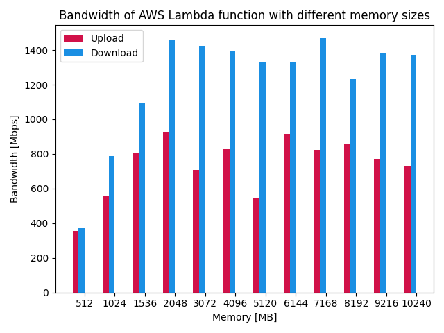
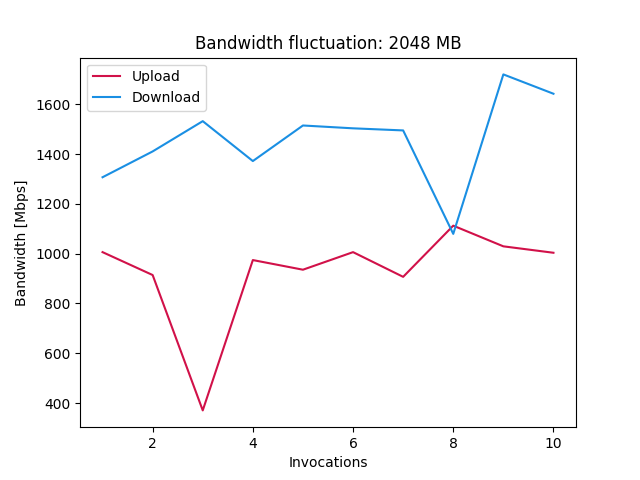

# AWS Lambda bandwith benchmark

This is a simple benchmark to test the bandwith of AWS Lambda.

## How do AWS Lambda instances scale?

When configuring a Lambda function, you can set the memory size and the timeout. The memory size is the amount of RAM available to the function. 
The timeout is the maximum amount of time the function can run.
The memory size does not only increase the amount of RAM available to the function, but also the CPU power.
To start I created a table with the available memory sizes and the corresponding CPU power. All prices are for the region `eu-central-1` and are in `USD`.

| Memory  | Cores | Speed  | Price per 1ms    |
|---------|-------|--------|------------------|
| 128MB   | 2     | 2,5Ghz | 0,0000000021 USD |
| 512MB   | 2     | 2,5Ghz | 0,0000000083 USD |
| 1024MB  | 2     | 2,5Ghz | 0,0000000167 USD |
| 1536MB  | 2     | 2,5Ghz | 0,0000000250 USD |
| 2048MB  | 2     | 2,5Ghz | 0,0000000333 USD |
| 3072MB  | 3     | 2,5Ghz | 0,0000000500 USD |
| 4096MB  | 3     | 2,5Ghz | 0,0000000667 USD |
| 5120MB  | 3     | 2,5Ghz | 0,0000000833 USD |
| 6144MB  | 4     | 2,5Ghz | 0,0000001000 USD |
| 7168MB  | 5     | 2,5Ghz | 0,0000001167 USD |
| 8192MB  | 5     | 2,5Ghz | 0,0000001333 USD |
| 9216MB  | 6     | 2,5Ghz | 0,0000001500 USD |
| 10240MB | 6     | 2,5Ghz | 0,0000001667 USD |

**Note**: Sometimes the CPU speed was 3.0Ghz instead of 2.5Ghz. But this was not consistent, so I decided to use 2.5Ghz as the CPU speed.

## How to test the bandwith?

To test the bandwith, I created the `generator.py` script that generates a random file with a given size, the script can be found in the `scripts` folder. The file is then uploaded to an S3 bucket. The lambda function with different sizes will download this file **10 times** in parallel, measure the time it takes to download the file and calculate the bandwith. After the file is downloaded the same file is uploaded **10 times** in parallel to the S3 bucket, here the time is taken as well and the bandwith is calculated. The results are then returned to the user.

To get better average readings I created a script (`graph.py`) that runs all the tests ten times, calculates the average bandwith, fluctuation of the test invokations and creates graphs for the results. The script can be found in the `scripts` folder.

## Bandwith compared to memory size


The graph shows the upload and download bandwith in relation to the memory size. We can see that the bandwidth increases almost linear until we reach the `4096MB` threshold. After that the bandwith flattens out.

## Bandwith at different times

I ran my tests at different times of the day to see if there is a difference in the bandwith. The idea behind this test was, that the usage of the AWS Lambda instances might be different at different times of the day. So it might be possible, that we reach higher numbers at night, when less people are using the same AWS Lambda instances.


## Fluctuation of the tests

In this last test I wanted to see how much the bandwith fluctuates between the different invokations of the lambda function. 



We can see quiet a big fluctuation in the bandwith. Sometimes it drops to almost half of the average bandwith. This is probably due to the fact, that the AWS Lambda instances are shared between different users. So if another user is using the same instance, the bandwith might drop.
You can see all the fluctuation graphs in the `graphs` folder. They all show a similiar pattern.

## Token based bandwith

As meantioned in the Paper ""

## Prices compared to EC2 instances

TODO

## Deployment

To deploy the functions run the command below. This script will create a new Lambda function for each memory size and upload the corresponding code.

```
$ serverless deploy
```