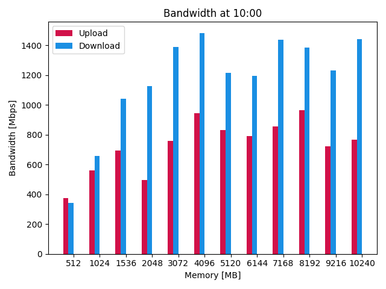

# AWS Lambda bandwith benchmark
## How do AWS Lambda instances scale?

When configuring a Lambda function, you can set the memory size and the timeout. The memory size is the amount of RAM available to the function. 
The timeout is the maximum amount of time the function can be executed.
The memory size not only increases the amount of RAM available to the function, but also the CPU power.
For starters, I have created a table with the available memory sizes and the corresponding CPU power. All prices are for the region `eu-central-1` and are in `USD`.

| Memory  | Cores | Speed  | Price per 1ms    |
|---------|-------|--------|------------------|
| 128MB   | 2     | 2,5Ghz | 0,0000000021 USD |
| 512MB   | 2     | 2,5Ghz | 0,0000000083 USD |
| 1024MB  | 2     | 2,5Ghz | 0,0000000167 USD |
| 1536MB  | 2     | 2,5Ghz | 0,0000000250 USD |
| 2048MB  | 2     | 2,5Ghz | 0,0000000333 USD |
| 3072MB  | 3     | 2,5Ghz | 0,0000000500 USD |
| 4096MB  | 3     | 2,5Ghz | 0,0000000667 USD |
| 5120MB  | 3     | 2,5Ghz | 0,0000000833 USD |
| 6144MB  | 4     | 2,5Ghz | 0,0000001000 USD |
| 7168MB  | 5     | 2,5Ghz | 0,0000001167 USD |
| 8192MB  | 5     | 2,5Ghz | 0,0000001333 USD |
| 9216MB  | 6     | 2,5Ghz | 0,0000001500 USD |
| 10240MB | 6     | 2,5Ghz | 0,0000001667 USD |

**Note**: Sometimes the CPU speed was 3.0Ghz instead of 2.5Ghz. But this was rarely the case, so I decided to use 2.5Ghz as the CPU speed for all.

## How to test the bandwith?

To test the bandwidth, I created the script `generator.py` which generates a random file of a certain size; the script is located in the folder `scripts`. The file is then uploaded to an S3 bucket. The Lambda function with different sizes downloads this file **10 times** in parallel, measures the time it takes to download the file and calculates the bandwidth. After the file is downloaded, the same file is uploaded **10 times** in parallel to the S3 bucket, again measuring the time and calculating the bandwidth. The results are then returned to the user.

To get better averages, I created a script (`graph.py`) that runs all the tests ten times, calculates the average bandwidth and the fluctuation of the test calls and creates graphs for the results. The script can be found in the `scripts` folder.

## Bandwith compared to memory size


The diagram shows the upload and download bandwidth as a function of the memory size. It can be seen that the bandwidth increases significantly with increasing storage size until it flattens out at around `1400 Mbps` and a storage size of `2048 MB`. Upload bandwidth also increases with increasing storage size, but peaks earlier at around `800 Mbps`. Note that these speeds are peaks, but more on that later.

## Bandwith at different times

I ran my tests at different times of the day to see if there was a difference in bandwidth. The idea behind this test was that the usage of AWS Lambda instances could be different at different times of the day. So it could be that we get higher numbers at night when fewer people are using the same AWS Lambda instances. This does not seem to be the case, as we actually achieved higher peak bandwidth at 15:00 than at 23:00. On the whole, however, the results remained about the same.




## Fluctuation of the tests

In this last test, I wanted to see how much the bandwidth varies between the different invocations of the lambda function. 


A strong fluctuation can be observed in the bandwidth. Sometimes it drops to almost half the average bandwidth. This is probably due to the fact that the AWS Lambda instances are shared by different users. So if another user is using the same instance, the bandwidth may drop.
You can see all the fluctuation graphs in the `graphs` folder. They all show a similar pattern.

## Bandwith over time

As noted in the paper ["Lambada: Interactive Data Analytics on Cold Data Using Serverless Cloud Infrastructure"](https://dl.acm.org/doi/10.1145/3318464.3389758), it has been suggested that AWS Lambda uses a form of token-based bandwidth throttling. This means that tokens are accumulated during times when bandwidth is not being used and then used during times when bandwidth is being used. This helps to better handle peaks in bandwidth usage.


To measure this behaviour, I increased my test size from 10 to 100 files, which are downloaded first and then uploaded in parallel. Although they are uploaded in parallel, you can clearly see that downloads/uploads started later are throttled. This is probably because the tokens are used up by the first downloads/uploads. It is interesting that the upload speed seems to stay the same for all calls, while the download speed decreases.
You can see all the fluctuation peaks in the `graphs` folder. They all show a similar pattern.

## Deployment

To deploy the functions, execute the following command. This script creates a new lambda function for each memory size and uploads the corresponding code.

```
$ serverless deploy
```